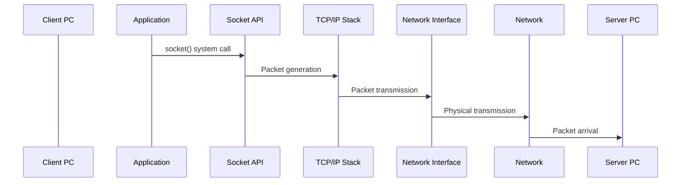
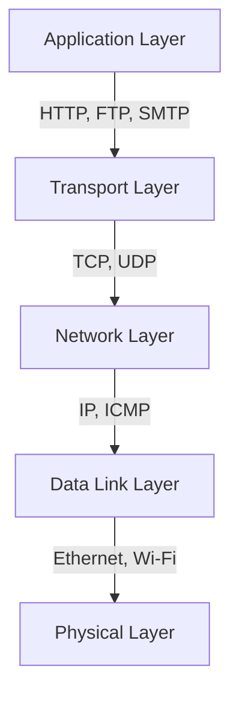

# Packet Flow Analysis: Client-Server Communication

## Overview

This document details the packet transmission flow from a client PC to a server PC, including the complete path and verification commands at each stage. The analysis was conducted on a local machine (localhost) to demonstrate the fundamental principles of TCP/IP communication.

## System Environment

```bash
# System Information
$ uname -a
Darwin wajis-Air 23.1.0 Darwin Kernel Version 23.1.0: Mon Oct  9 21:28:12 PDT 2023; root:xnu-10002.41.9~6/RELEASE_ARM64_T8103 x86_64

# Current Time
$ date
Sun Apr 13 10:56:36 JST 2025
```

## Packet Flow Diagram



## Socket Communication Basics

### What is a Socket?
- A special gateway connecting programs to the TCP/IP world
- Acts as a conceptual telephone or mailbox between computers
- Enables data transmission using file I/O operations

### Socket Types
1. **Internet Sockets**
   - Used for communication between different machines
   - Utilizes TCP/IP protocol

2. **UNIX Domain Sockets**
   - Used for inter-process communication on the same machine
   - Referenced as inodes in the filesystem
   - Enables high-efficiency communication

## Detailed Flow Analysis

### 1. Application Layer

1. **Socket Creation and Connection**
   ```c
   // Socket creation
   int sockfd = socket(AF_INET, SOCK_STREAM, 0);
   
   // Connection establishment
   connect(sockfd, (struct sockaddr *)&serv_addr, sizeof(serv_addr));
   
   // Data transmission
   send(sockfd, buffer, strlen(buffer), 0);
   ```

2. **Verification Commands**
   ```bash
   # Socket state verification
   netstat -an | grep ESTABLISHED
   
   # Process socket usage
   lsof -i
   ```

### 2. Kernel Space (TCP/IP Stack)

1. **TCP Connection Establishment Process**
   - SYN Queue: Queue for pending connection requests
   - Accept Queue: Queue for established connections
   - 3-way handshake processing

2. **Packet Processing**
   - Kernel processes packets in TCP/IP stack
   - Header information addition
   - Routing table reference

3. **Verification Commands**
   ```bash
   # Routing table verification
   route -n
   
   # TCP connection statistics
   netstat -s
   
   # SYN Queue and Accept Queue state verification
   ss -lnt
   ```

### 3. Network Interface Layer

1. **Packet Transmission**
   - NIC driver processes packets
   - Physical transmission preparation
   - Actual transmission

2. **Verification Commands**
   ```bash
   # Network interface statistics
   ifconfig
   
   # Packet transmission/reception status
   tcpdump -i eth0
   
   # Detailed network statistics
   netstat -i
   ```

### 4. Network Path

1. **Packet Forwarding**
   - Routing through routers and switches
   - Routing at each node
   - Final destination arrival

2. **Verification Commands**
   ```bash
   # Path tracing
   traceroute <server_ip>
   
   # Path verification
   mtr <server_ip>
   
   # Detailed routing information
   ip route show
   ```

## Practical Communication Example

### Test Programs

1. **Client Program (simple_client.c)**
```c
// Socket creation
int sockfd = socket(AF_INET, SOCK_STREAM, 0);

// Server connection
connect(sockfd, (struct sockaddr *)&serv_addr, sizeof(serv_addr));

// Message transmission
send(sockfd, message, strlen(message), 0);
```

2. **Server Program (simple_server.c)**
```c
// Socket creation
int server_fd = socket(AF_INET, SOCK_STREAM, 0);

// Socket binding
bind(server_fd, (struct sockaddr *)&address, sizeof(address));

// Connection waiting
listen(server_fd, 3);

// Connection acceptance
new_socket = accept(server_fd, (struct sockaddr *)&address, &addrlen);
```

### Execution Log

1. **Packet Capture Initiation**
```bash
$ sudo tcpdump -i any port 8080 -w packet_capture.pcap
tcpdump: data link type PKTAP
tcpdump: listening on any, link-type PKTAP (Apple DLT_PKTAP), snapshot length 524288 bytes
```

2. **Server Startup**
```bash
$ ./server
Server listening on port 8080
Client connected
Received message: Hello from client!
Response sent: Hello from server!
```

3. **Client Connection Attempt**
```bash
$ ./client 127.0.0.1
Connected to server 127.0.0.1:8080
Message sent: Hello from client!
Server response: Hello from server!
```

### Communication Analysis Results

1. **traceroute Results**
```bash
traceroute to 127.0.0.1 (127.0.0.1), 64 hops max, 52 byte packets
1  localhost (127.0.0.1)  0.288 ms  0.072 ms  0.045 ms
```
- Localhost communication completes in 1 hop
- Very short response time (0.045ms to 0.288ms)
- No router traversal (direct communication via loopback interface)

2. **Routing Information**
```bash
Internet:
Destination        Gateway            Flags               Netif Expire
127                127.0.0.1          UCS                   lo0       
127.0.0.1          127.0.0.1          UH                    lo0       
```
- Traffic to `127.0.0.1` routes through `lo0` (loopback interface)
- Flag meanings:
  - `U`: Up state
  - `H`: Host entry
  - `C`: Clone
  - `S`: Static entry

3. **Communication Flow Characteristics**
- Client connection requests (port 8080) route through loopback interface (lo0)
- No physical network interface traversal, processed internally in OS TCP/IP stack
- Very low communication latency (less than 1ms)
- All packets processed within local machine, no external network traversal

4. **macOS-Specific Characteristics**
- Packet capture data link type: `PKTAP` (Apple DLT_PKTAP)
- Optimized loopback interface processing
- High localhost communication performance

## Troubleshooting

### Common Verification Commands

```bash
# Network connection verification
ping <server_ip>

# Port availability check
nc -zv <server_ip> <port_number>

# Firewall configuration check
iptables -L

# Socket state verification
ss -tuln

# Detailed TCP connection information
netstat -tulpen
```

## References

- [Web Server Architecture Evolution 2023](https://blog.ojisan.io/server-architecture-2023/)
- Linux Network Programming Documentation
- TCP/IP Protocol Specifications

## Network Layers and Devices

### 1. Physical Layer
The physical layer defines all physical specifications and handles the conversion of packets into physical signals (electrical, optical, or radio waves).

**Key Devices:**
- **NIC (Network Interface Card)**
  - Converts digital data into physical signals
  - Handles signal transmission and reception
  - Implements physical layer protocols

- **Repeater**
  - Amplifies and regenerates signals
  - Extends network reach
  - Works at the bit level

- **Repeater Hub**
  - Multi-port repeater
  - Broadcasts signals to all connected devices
  - Creates a single collision domain

- **Media Converter**
  - Converts between different physical media types
  - Enables connection between different network types
  - Maintains signal integrity

- **Access Point (AP)**
  - Converts between wired and wireless signals
  - Manages wireless client connections
  - Implements wireless protocols (802.11)

### 2. Data Link Layer
The data link layer enables communication between devices on the same network using MAC addresses.

**Key Components:**
- **Bridge**
  - Connects different network segments
  - Filters traffic based on MAC addresses
  - Creates separate collision domains

- **Layer 2 Switch**
  - High-performance bridge
  - Maintains MAC address tables
  - Provides dedicated bandwidth per port

- **MAC Address Table**
  - Maps MAC addresses to switch ports
  - Enables efficient packet forwarding
  - Reduces unnecessary broadcasts

### 3. Network Layer
The network layer connects different networks using IP addresses for packet routing.

**Key Components:**
- **Router**
  - Connects different networks
  - Makes routing decisions based on IP addresses
  - Implements routing protocols

- **Routing Table**
  - Contains network path information
  - Used for packet forwarding decisions
  - Updated by routing protocols

- **Routing Protocols**
  - RIP, OSPF, BGP
  - Exchange routing information
  - Maintain network topology

- **NAT (Network Address Translation)**
  - Translates between private and public IPs
  - Enables multiple devices to share one public IP
  - Provides basic security

- **IPsec VPN**
  - Creates secure tunnels over public networks
  - Encrypts network traffic
  - Provides authentication

- **PPPoE**
  - Encapsulates PPP frames in Ethernet
  - Used for DSL connections
  - Provides authentication

- **DHCP**
  - Automatically assigns IP addresses
  - Manages IP address pools
  - Provides network configuration

- **Layer 3 Switch**
  - Combines routing and switching
  - High-performance routing
  - Hardware-based forwarding

- **FPGA/ASIC**
  - Hardware acceleration for routing
  - High-speed packet processing
  - Custom networking functions

### 4. Transport Layer
The transport layer provides application identification and communication control using port numbers.

**Key Components:**
- **Firewall**
  - Filters traffic based on rules
  - Controls access between networks
  - Provides security

- **Stateful Inspection**
  - Tracks connection state
  - Makes dynamic filtering decisions
  - Provides enhanced security

### 5. Application Layer
The application layer provides services to end users and handles application-specific protocols.

**Key Components:**
- **Next-Generation Firewall**
  - Deep packet inspection
  - Application awareness
  - Advanced threat protection

- **WAF (Web Application Firewall)**
  - Protects web applications
  - Filters HTTP/HTTPS traffic
  - Prevents web attacks

- **Layer 7 Switch (Load Balancer)**
  - Distributes application traffic
  - Provides high availability
  - Optimizes resource usage

## Network Protocol Stack



### Protocol Examples by Layer:

1. **Application Layer**
   - HTTP/HTTPS
   - FTP
   - SMTP
   - DNS
   - DHCP

2. **Transport Layer**
   - TCP
   - UDP
   - SCTP

3. **Network Layer**
   - IPv4/IPv6
   - ICMP
   - IGMP
   - IPsec

4. **Data Link Layer**
   - Ethernet
   - Wi-Fi (802.11)
   - PPP
   - Frame Relay

5. **Physical Layer**
   - Ethernet (10/100/1000BASE-T)
   - Wi-Fi (802.11 a/b/g/n/ac/ax)
   - Fiber Optic
   - DSL

## Verification Command Results

### 1. Application Layer Verification

1. **Socket State Verification**
```bash
$ netstat -an | grep ESTABLISHED
tcp4       0      0  192.168.0.247.56295    3.208.121.208.443      ESTABLISHED
tcp4       0      0  192.168.0.247.54783    54.236.144.31.443      ESTABLISHED
tcp4       0      0  192.168.0.247.54699    35.172.83.173.443      ESTABLISHED
tcp6       0      0  2001:268:738e:cf.54039 2001:268:738e:cf.49199 ESTABLISHED
tcp4       0      0  192.168.0.247.54045    17.188.169.136.5223    ESTABLISHED
```
- Shows all established TCP connections
- Includes both IPv4 and IPv6 connections
- Displays local and remote addresses with ports
- Indicates active connections to various services (HTTPS, IMAPS, etc.)

2. **Process Socket Usage**
```bash
$ lsof -i
COMMAND     PID   USER   FD   TYPE             DEVICE SIZE/OFF NODE NAME
Cursor    37397 subaru   34u  IPv4 0xd7712d281dedb47b      0t0  TCP wajis-air:53443->ec2-44-207-96-59.compute-1.amazonaws.com:https (ESTABLISHED)
Cursor    37397 subaru   35u  IPv4 0xd7712d281f72ffdb      0t0  TCP wajis-air:60834->ec2-54-204-61-0.compute-1.amazonaws.com:https (ESTABLISHED)
```
- Lists all open network connections
- Shows process names and PIDs
- Displays connection types (TCP/UDP)
- Includes both listening and established connections

### 2. Network Layer Verification

1. **Routing Table Information**
```bash
$ netstat -rn
Routing tables

Internet:
Destination        Gateway            Flags               Netif Expire
default            192.168.0.1        UGScg                 en0       
127                127.0.0.1          UCS                   lo0       
127.0.0.1          127.0.0.1          UH                    lo0       
192.168.0          link#12            UCS                   en0      !
192.168.0.247/32   link#12            UCS                   en0      !
```
- Shows routing table entries
- Displays default gateway (192.168.0.1)
- Includes loopback interface (lo0) configuration
- Shows local network (192.168.0.0/24) routing

2. **TCP/IP Statistics**
```bash
$ netstat -s
tcp:
        0 packet sent
        0 packet received
        0 connection request
        0 connection accept
        0 connection established
        0 connection closed

udp:
        21419281 datagrams received
        20411027 datagrams output
```
- Displays detailed protocol statistics
- Shows packet counts for TCP and UDP
- Includes error and retransmission statistics
- Provides connection state information

### 3. Network Interface Verification

1. **Interface Configuration**
```bash
$ ifconfig
lo0: flags=8049<UP,LOOPBACK,RUNNING,MULTICAST> mtu 16384
        inet 127.0.0.1 netmask 0xff000000
        inet6 ::1 prefixlen 128 

en0: flags=8863<UP,BROADCAST,SMART,RUNNING,SIMPLEX,MULTICAST> mtu 1500
        ether d4:57:63:eb:e2:58
        inet 192.168.0.247 netmask 0xffffff00 broadcast 192.168.0.255
```
- Shows all network interfaces
- Displays interface flags and MTU
- Includes IPv4 and IPv6 addresses
- Shows MAC addresses for physical interfaces

### 4. Packet Analysis

1. **Packet Capture**
```bash
$ sudo tcpdump -i any port 8080 -w packet_capture.pcap
tcpdump: data link type PKTAP
tcpdump: listening on any, link-type PKTAP (Apple DLT_PKTAP), snapshot length 524288 bytes
```
- Captures packets on specified port
- Uses PKTAP data link type (macOS specific)
- Shows capture interface and buffer size
- Indicates successful capture initialization